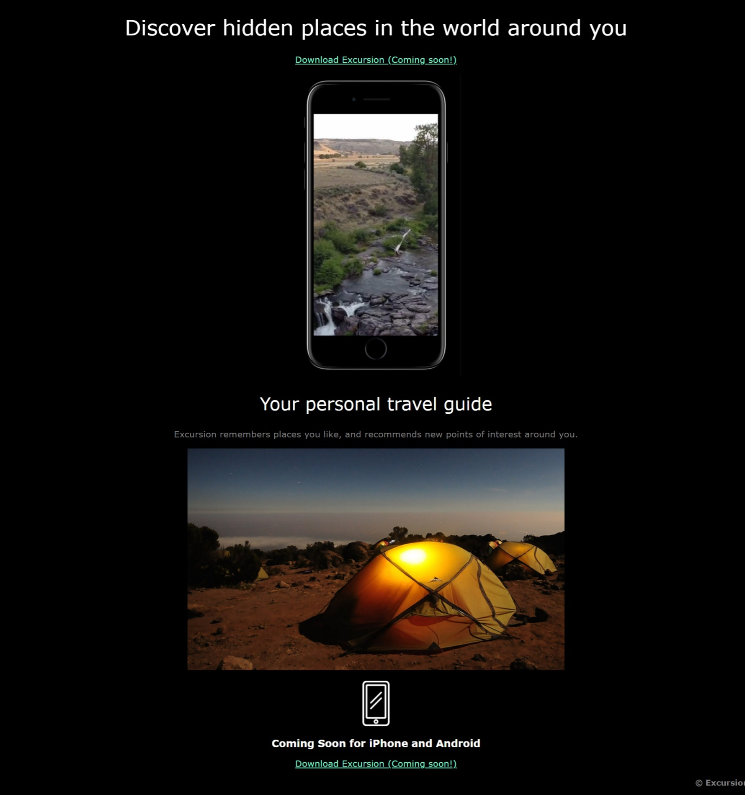

# Excursion

Discover hidden places in the world around you with Excursion, your personal travel guide.

## Features

- **Discover Hidden Places:** Excursion helps you find hidden gems and unique locations.
- **Personalized Recommendations:** Excursion remembers places you like and suggests new points of interest.
- **Coming Soon for iPhone and Android:** Excursion will be available for download on iPhone and Android soon!

## Installation

1. Clone the repository: `git clone https://github.com/your-username/excursion.git`
2. Open `index.html` in your web browser.

## Usage

1. Visit the Excursion website.
2. Click on the "Download Excursion" button to get the app (Coming soon!).
3. Explore hidden places and enjoy personalized recommendations.

## Screenshots

